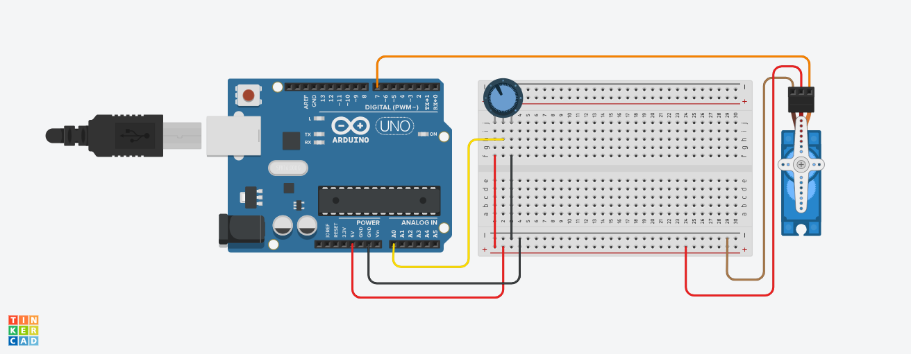
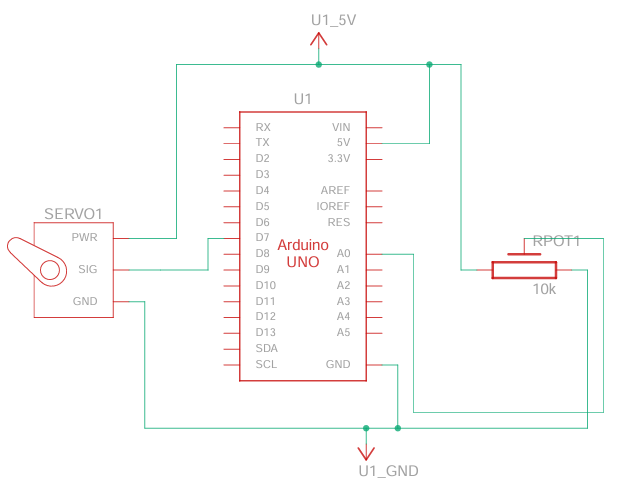

# SG90 Micro Servo Control Using a 10k&Omega; Potentiometer
<p align = "center"></p>
<p align = "center"><b>Figure 1.</b> SG90 micro servo motor setup designed in <a href = "https://www.tinkercad.com">Tinkercad</a>. Test and try the circuit through this <a href = "https://www.tinkercad.com/things/as3s0rsZMul-sg90-micro-servo-control-with-potentiometer?sharecode=aHOOacvLJhVkbbtP7IE3Dn5av6y1MOTj1NUGFpsI-eQ">simulation</a>.</p>

# Background
Frankenstein is one of my favorite novels because it encapsulates themes of adventure, mystery, and science. The creation process of Victor's "monster" was the most interesting part, describing the arduous and systematic procedure through which he underwent. The galvanizing moment the monster awakened is also the moment my curiosity in autonomous systems awakened. I am very much interested in robots and machine, as much as the Czech word "_stroj_" is one of my favorite words ("_robot_" actually originates from Czech as well). These have led me to&mdash;not to create my own living creature&mdash;design systems that can move, and possibly think.

As I have a degree in electronics and recently started little projects with Arduino, it would be interesting to embark on an exciting challenge of creating my own robot. To achieve this, I have to determine the necessary components to build a robot, and learn how they operate. I do not yet know what kind of robot I am aiming for, but I envision it to have a mechanical and computational parts. Hence, eumerated below are the components that will be of use for each part:
- Mechanical: motors, servo motors, wheels
- Computational: Raspberry Pi (RPi) with camera

With these in mind, I am starting to learn how each electronic component. I start with SG90 micro servo motor below, which is commercially available.

## Materials
<p align = "center"></p>
<p align = "center"><b>Figure 2.</b> Circuit schematic for SG90 potentiometer control, created using <h href = "https://www.tinkercad.com">Tinkercad</h>. It is recommended to have a separate power supply for the SG90 micro servo motor because it drains a lot of current, and might destroy the Arduino UNO microcontroller if connected directly to its 5-V pin.</p>

- SG90 micro servo motor
- Arduino UNO microcontroller
- 10k&Omega; potentiometer
- Connector wires
- External power supply (breadboard power supply is possible)

## Code Description

Note that the PWM period does not matter as long as the ON time is specified to the corresponding angle duration to which the shaft rotates (e.g. 2.4 ms for 180&deg; rotation, and see reference). To avoid possible glitches due to possible small changes, set a threshold.

Initialize the parameters:
```c
int pin_servo = 7;
int pin_potentiometer = A0;
unsigned long period_ref;
unsigned long pwm_period = 20000;
unsigned long on_length = 2400;
unsigned long old_val = on_length;
int threshold = 5;
```
where
- `pin_servo` : the outpin pin that feeds the PWM signal into the servo motor
- `pin_potentiometer` :  the input pin that reads the voltage drop caused by adjusting the potentiometer
- `pwm_period` : defined period of the PWM

In the setup, assign the pins above as either inputs or output accordingly:
```c
void setup() {
  // put your setup code here, to run once:
  pinMode(pin_servo, OUTPUT);
  pinMode(pin_potentiometer, INPUT);
  Serial.begin(9600);
  period_ref = micros();
}
```
## Inside the loop
Determine the current time
```c
unsigned long time = micros();
```
Then specify what happens inside each period:
```c
if (time - period_ref <= pwm_period) {
  ...
}
```
The angle to which the shaft rotates depends on how long each PWM signal is ON; equivalently, how long `on_length` is in a PWM period. For each period, it can be defined that the PWM signal is initially on within the time duration of `on_length`, and off for the rest of the period:
```c
if (time - period_ref <= on_length) {
    digitalWrite(pin_servo, HIGH);
  }
else {
  digitalWrite(pin_servo, LOW);
  ...
  }
}
```
During the off state, take this time to read the potentiometer and define a threshold:
```c
unsigned long val = 1900L * analogRead(pin_potentiometer) / 1023 + 500;
if (abs(val - old_val) > threshold) {
    on_length = val;
    old_val = val;
}
```

Also add:
```c
else if (time - period_ref > pwm_period) {
  period_ref = micros();
}

```

Overall code:
```c
int pin_servo = 7;
int pin_potentiometer = A0;
unsigned long period_ref;
unsigned long pwm_period = 20000;
unsigned long on_length = 2400;
unsigned long old_val = on_length;
int threshold = 5;


void setup() {
  // put your setup code here, to run once:
  pinMode(pin_servo, OUTPUT);
  pinMode(pin_potentiometer, INPUT);
  Serial.begin(9600);
  period_ref = micros();

}

void loop() {
  // put your main code here, to run repeatedly:
  unsigned long time = micros();
  // on_length = 1900 * analogRead(pin_potentiometer) / 1023 + 500;
  // Serial.println(String(analogRead(pin_potentiometer)) + ", " + String(on_length));
  
  if (time - period_ref <= pwm_period) {
    if (time - period_ref <= on_length) {
      digitalWrite(pin_servo, HIGH);
    }
    else {
      digitalWrite(pin_servo, LOW);
      unsigned long val = 1900L * analogRead(pin_potentiometer) / 1023 + 500;
      if (abs(val - old_val) > threshold) {
        on_length = val;
        old_val = val;
      }
    }
  }

  else if (time - period_ref > pwm_period) {
    period_ref = micros();
  }
}

```
